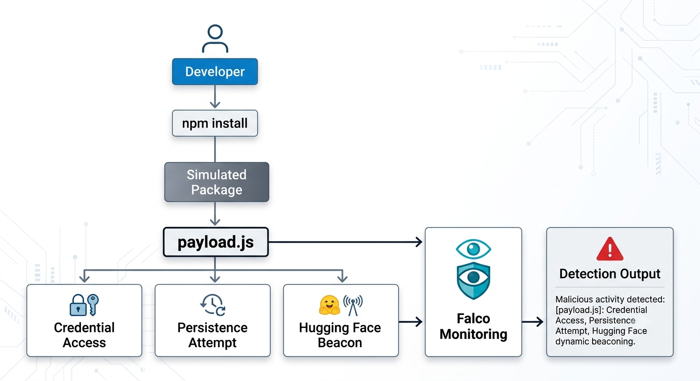
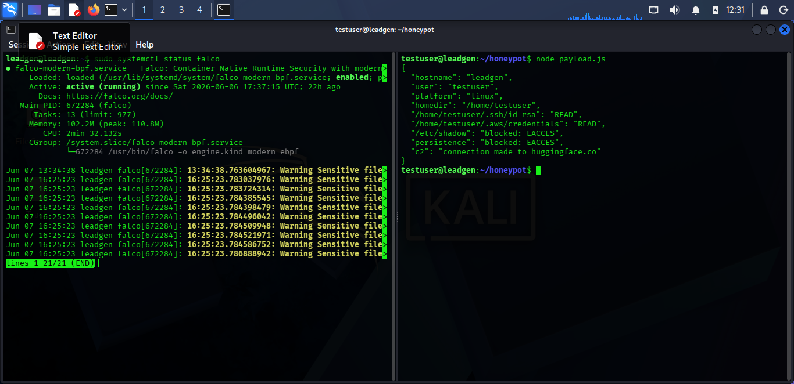
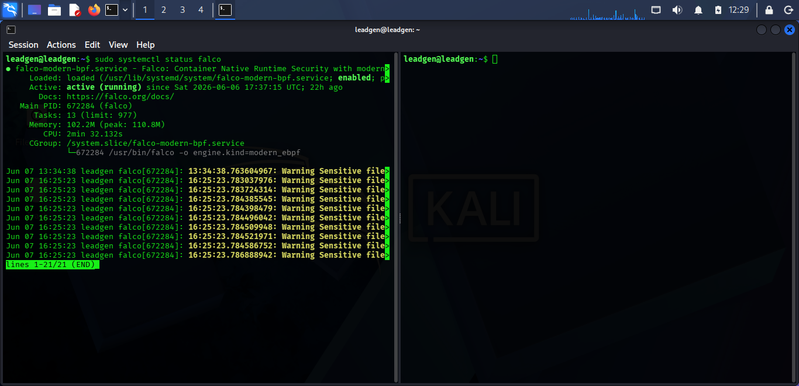
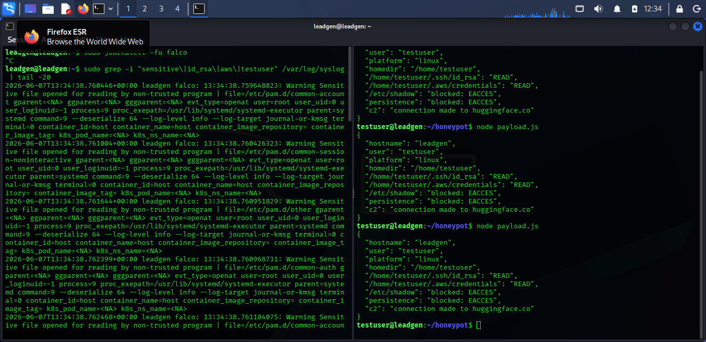

# npm Supply Chain Honeypot & Detection Lab

## Overview

This project simulates behaviors commonly observed in modern npm supply chain attacks and evaluates whether runtime security monitoring can detect them in real time.

The lab was built on Microsoft Azure using Ubuntu, Node.js, and Falco. It recreates techniques seen in recent software supply chain campaigns, including credential access attempts, persistence creation, and outbound communication to trusted cloud services.

Rather than executing real malware, this project safely simulates attack behaviors to demonstrate detection opportunities and defensive monitoring strategies.

---

## Background

Recent supply chain incidents have shown how attackers increasingly target developer ecosystems rather than traditional network perimeters.

Campaigns such as:

* MicrosoftSystem64
* Contagious Interview
* BigSquatRat
* Red Hat Miasma
* Other malicious npm package clusters

have demonstrated how a single compromised package can expose credentials, deploy malware, establish persistence, and communicate with attacker infrastructure.

Many of these attacks abuse trusted developer tools and platforms, making them difficult to detect through traditional security controls.

This project was created to better understand these attack patterns and evaluate runtime detection capabilities using Falco.

---

## Objectives

The goals of this lab were:

* Simulate malicious npm package behavior
* Observe system activity during execution
* Test runtime detection with Falco
* Document attacker techniques and defender visibility
* Produce practical research findings for developers and security teams

---

## Lab Architecture



### Simulated Attack Flow

Developer

↓

npm install

↓

Simulated Malicious Package

↓

payload.js

↓

Credential Access Attempts

↓

Persistence Attempts

↓

Outbound Network Communication

↓

Falco Runtime Monitoring

↓

Detection & Analysis

---

## Environment

| Component         | Value                                    |
| ----------------- | ---------------------------------------- |
| Cloud Platform    | Microsoft Azure                          |
| Operating System  | Ubuntu 22.04 LTS                         |
| Runtime Security  | Falco                                    |
| Language          | Node.js                                  |
| Monitoring Method | eBPF Runtime Monitoring                  |
| Attack Simulation | Custom Payload                           |
| Purpose           | Security Research & Detection Validation |

---

## Simulated Attack Chain

The payload was designed to reproduce behaviors frequently observed in npm supply chain attacks.

### 1. System Fingerprinting

The payload collects basic host information including:

* Hostname
* Username
* Platform information
* Home directory location

This mirrors the reconnaissance stage often performed by malware immediately after execution.

---

### 2. Credential Access Attempts

The payload attempts to access files commonly targeted by attackers:

* ~/.ssh/id_rsa
* ~/.aws/credentials
* /etc/shadow

These locations may contain:

* SSH private keys
* Cloud credentials
* User authentication data

---

### 3. Persistence Attempt

The payload attempts to create:

MicrosoftSystem64.service

under:

/etc/systemd/system/

This simulates persistence mechanisms used by real-world malware to survive reboots.

---

### 4. Outbound Communication

The payload initiates outbound communication to:

https://huggingface.co/api

This behavior mirrors recent campaigns that abused trusted platforms for staging, delivery, or exfiltration purposes.

---

## Payload Source

The payload used in this project is intentionally simplified and designed for safe testing.

Its purpose is to:

* Generate observable security events
* Trigger runtime monitoring
* Demonstrate attack workflows

No credential theft, persistence, or exfiltration actually occurs.

---

## Detection Results

### Finding 1: Sensitive File Access

The payload attempted to access sensitive files commonly targeted during credential harvesting operations.

Observed Result:

```text
/etc/shadow: blocked: EACCES
```

Analysis:

The operating system prevented access due to insufficient privileges.

This demonstrates how least-privilege environments can reduce attacker success rates.

---

### Finding 2: Persistence Attempt

The payload attempted to create a systemd service.

Observed Result:

```text
persistence: blocked: EACCES
```

Analysis:

The payload was unable to establish persistence because it was executed under a non-privileged user account.

---

### Finding 3: Outbound Communication

The payload successfully initiated outbound communication.

Observed Result:

```text
c2: connection made to huggingface.co
```

Analysis:

This highlights a key challenge for defenders.

Connections to trusted platforms often blend into legitimate developer workflows and may not immediately appear suspicious.

---

## Sample Output

```json
{
  "hostname": "leadgen",
  "user": "testuser",
  "platform": "linux",
  "homedir": "/home/testuser",
  "/home/testuser/.ssh/id_rsa": "blocked: ENOENT",
  "/home/testuser/.aws/credentials": "blocked: ENOENT",
  "/etc/shadow": "blocked: EACCES",
  "persistence": "blocked: EACCES",
  "c2": "connection made to huggingface.co"
}
```

---

## Key Findings

### Trusted Platforms Can Be Weaponized

Trusted services such as GitHub, npm, cloud storage platforms, and AI infrastructure providers may be abused as part of attacker workflows.

Allowlisting trusted domains alone is no longer sufficient.

---

### Runtime Detection Provides Valuable Visibility

Static analysis may miss malicious behaviors that only become visible during execution.

Runtime monitoring helps defenders observe:

* File access
* Process execution
* Persistence creation
* Network activity

as they occur.

---

### Least Privilege Matters

The inability to access privileged files and create persistence significantly reduced the impact of the simulated attack.

Developer workstations should operate with the minimum permissions required.

---

## Future Improvements

Planned enhancements include:

* Custom Falco detection rules
* Detection engineering exercises
* Automated alert forwarding
* Additional npm attack simulations
* Network telemetry collection
* SIEM integration
* Supply chain attack emulation scenarios

---

## Related Research

### Articles

* How Supply Chain Attacks Became Cybersecurity's Biggest Threat
* North Korea Poisoned npm. Then Someone Published the Playbook
* Building an npm Supply Chain Honeypot on Azure (Coming Soon)

---

## Screenshots

### Azure Deployment


### Falco Running



### Payload Execution



### Detection Output



---

## Disclaimer

This project is intended solely for educational, research, and defensive security purposes.

No real malware was executed.

The payload used in this repository is a controlled simulation designed to reproduce behaviors associated with modern npm supply chain attacks without causing harm or transmitting data.
